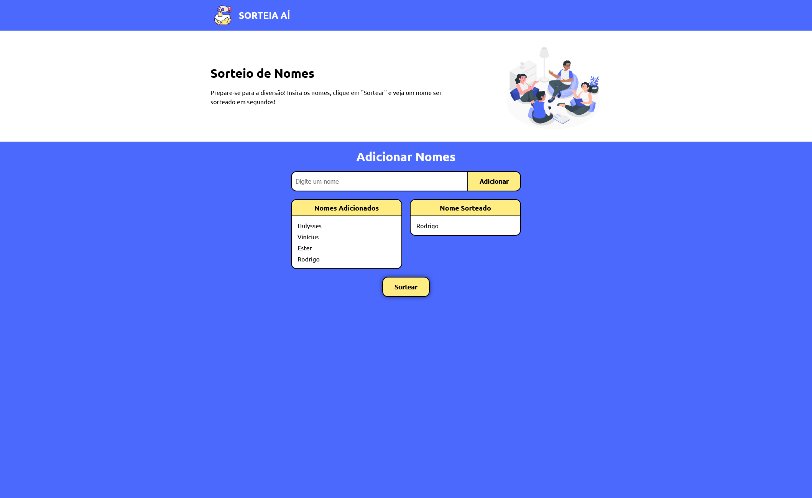

# Sorteia Aí

## 📋 Sobre o projeto

O projeto consiste em um sorteador de nomes para facilitar a organização de um amigo secreto. Insira os nomes dos participantes e clique em "Sortear" para ver um nome ser sorteado.

<div align="center">
     
</div

#

## 🌐 Deploy

Link: https://sorteia-ai.vercel.app/

## 🚀 Tecnologias

As seguintes tecnologias foram utilizadas no desenvolvimento do projeto:

- HTML
- CSS
- JavaScript

## 📦 Como executar o projeto

Para executar o projeto, siga os passos abaixo:

1. Clone o repositório:

   ```bash
   git clone https://github.com/hulysses/sorteia-ai.git
   ```

2. Navegue até o diretório do projeto:
   ```bash
   cd amigo-secreto-js
   ```

## 🛠️ Funcionalidades

- Adicionar nomes à lista de participantes.
- Sortear um nome aleatoriamente da lista de participantes.

## 👨‍💻 Autor

Feito com ❤️ por Hulysses.

- [LinkedIn](https://www.linkedin.com/in/hulysses)
